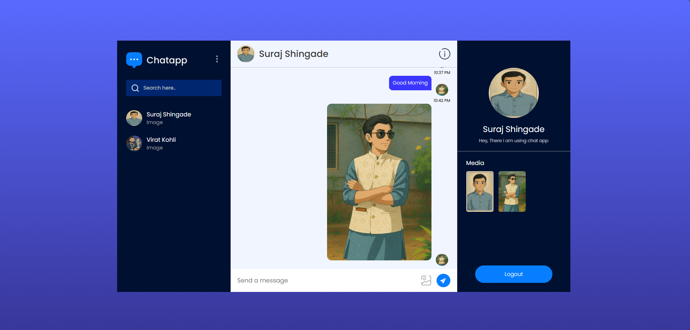
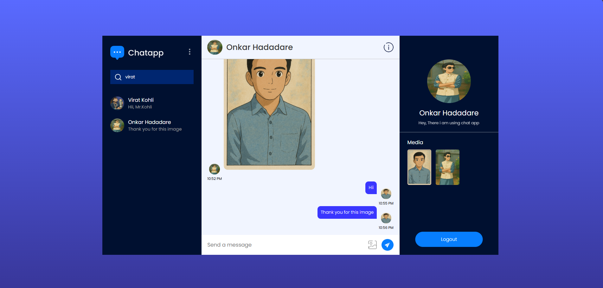
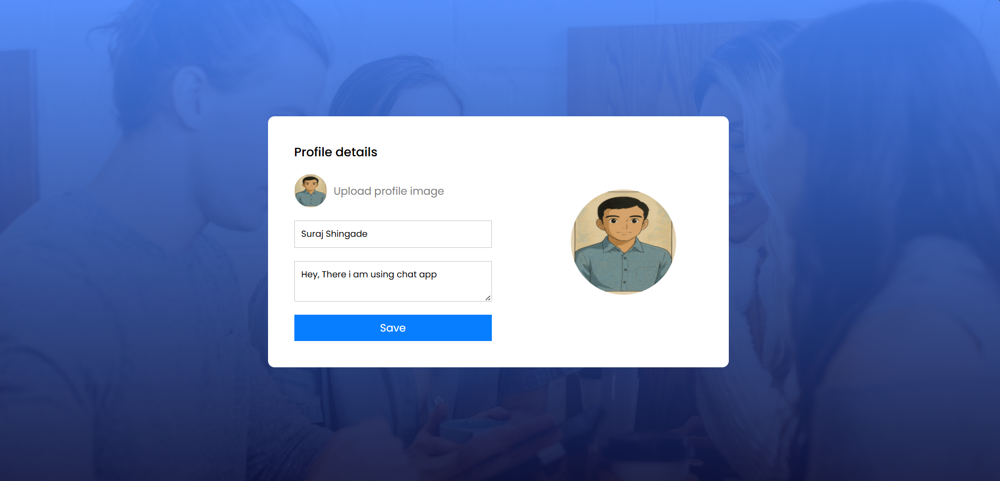

# 💬 SSChat - Realtime Chat App

## 🚀 Overview

**Realtime Chat App** is a sleek and modern chat application built with **React** and powered by **Firebase**. It allows users to chat in real-time with a seamless and responsive user experience. Whether you're building a individual chatting tool, this app is the perfect foundation.

---

## ✨ Features

- 🔐 **User Authentication**
  - Sign up and log in using **Google Authentication** via Firebase Auth

- 💬 **Realtime Messaging**
  - Send and receive messages instantly using **Firebase Realtime Database** or **Cloud Firestore**

- 🧑‍🤝‍🧑 **Active Users Tracking**
  - View real-time updates of active users ```````````````````

- 🌙 **Responsive UI**
  - Mobile-friendly, clean, and intuitive chat interface built with React and Tailwind CSS or Material UI

- 🕒 **Timestamps**
  - Every message is time-stamped for clear conversation flow

- 📦 **Firebase Integration**
  - Secure and scalable backend with Firebase services

---

## 🛠️ Tech Stack

### Frontend

- ⚛️ **React.js** – Component-based UI
- 🎨 **Tailwind CSS** / **Material UI** – Styling and layout
- 🔄 **React Hooks & Context API** – State and context management

### Backend / Realtime

- 🔥 **Firebase**
  - **Authentication** – Google Sign-in
  - **Cloud Firestore** or **Realtime Database** – For live messaging
  - **Firebase Hosting**  – For quick deployment

---

## 🌐 Live Demo

Experience the real-time chat application in action!

🔗 **Live Website:** [Click Here to Try It Out](https://surajchat-5359f.web.app/)

---

## 📸 Screenshots

### 📱 Responsive Design Preview

#### 📝 Sign Up Page
<p align="center">
  
</p>

#### 🔐 Sign In Page
<p align="center">
  
</p>

#### 💬 Chat Page - View 1
<p align="center">
  
</p>

#### 💬 Chat Page - View 2
<p align="center">
  
</p>

#### 👤 Update Profile Page
<p align="center">
  
</p>
